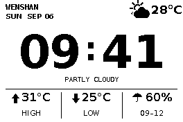
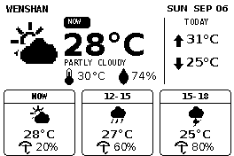

# Sablier

Sablier 是一個為 Raspberry Pi 與 Waveshare 2.7 吋黑白電子紙設計的常駐儀表板。它直接使用本機 Codex CLI 與 Claude Code 的登入狀態，顯示 ChatGPT/Codex、Claude 的剩餘額度，並提供文山時鐘與短期天氣預報畫面。

> 專案目前針對 **Waveshare 2.7inch e-Paper HAT V2（264×176）** 與 Raspberry Pi 3 開發及測試。

## 畫面預覽

| KEY1：使用量 | KEY2：時鐘與天氣 | KEY3：短期天氣 |
| --- | --- | --- |
|  |  |  |

預覽使用固定的示範資料產生，不包含真實帳號、額度或 API key。

## 功能

- 同一畫面顯示 Claude 與 ChatGPT/Codex 的 Session、Weekly 剩餘百分比及重置時間。
- 自動沿用 Codex CLI 與 Claude Code 的 OAuth 登入，必要時刷新 access token。
- 個別服務或網路失敗時保留最後成功資料，並在對應 Logo 旁顯示警告圖示。
- KEY1/KEY2/KEY3 切換使用量、時鐘及短期天氣模式，KEY4 隨時強制刷新目前畫面。
- 時鐘模式顯示文山目前溫度、天氣、高低溫與目前 3 小時區段的降雨機率。
- 天氣模式顯示目前天氣、體感溫度、濕度，以及未來三個 3 小時區段的天氣、溫度與降雨機率。
- 有中央氣象署 API key 時優先使用 CWA，否則自動使用免 key 的 Open-Meteo。
- 支援 Waveshare V2 局部刷新，並定期全面刷新以降低殘影。
- 每次刷新完成都讓面板進入 sleep 並關閉 HAT 電源腳位，避免面板長時間維持高電壓。
- 使用單一常駐程序管理排程、按鍵與畫面，不需要 cron。

## 按鍵與刷新規則

| 按鍵 | BCM GPIO | 行為 |
| --- | ---: | --- |
| KEY1 | 5 | 切換到 Claude / Codex 使用量模式 |
| KEY2 | 6 | 切換到文山時鐘與天氣模式 |
| KEY3 | 13 | 切換到文山短期天氣預報模式 |
| KEY4 | 19 | 立即取得目前模式的新資料並全面刷新 |

| 模式 | 自動更新 | 全面刷新策略 |
| --- | --- | --- |
| 使用量 | 每 5 分鐘 | 連續 5 次局部刷新後全面刷新 |
| 時鐘 | 對齊每分鐘整點 | 連續 15 次局部刷新後全面刷新 |
| 短期天氣 | 每 15 分鐘 | 每小時全面刷新一次 |
| 天氣資料 | 最多每 15 分鐘抓取一次 | KEY4 會略過快取並立即重抓 |

按下 KEY4 後會完成一次全面刷新，接著從該次操作重新計算使用量模式的 5 分鐘排程；時鐘模式則重新對齊下一個整分鐘。程式用 100 ms debounce 避免一次按壓被重複觸發，並以 `output/refresh.lock` 防止同時刷新。

## 硬體與系統需求

- Raspberry Pi（目前實機為 Raspberry Pi 3）
- Waveshare 2.7inch e-Paper HAT V2，直接安裝於 40-pin GPIO
- Raspberry Pi OS，已啟用 SPI
- Python 3.11 或更新版本
- 可正常連線至 ChatGPT、Anthropic 及天氣資料服務的網路
- 已登入的 Codex CLI 與 Claude Code

## 安裝

### 1. 取得程式

以下安裝位置與附帶的 systemd user service 相符：

```bash
mkdir -p ~/Developer
git clone https://github.com/happylittle7/Sablier.git ~/Developer/Sablier
cd ~/Developer/Sablier
```

若放在其他位置，請同步修改 `systemd/sablier.service` 的 `WorkingDirectory` 與 `ExecStart`。

### 2. 安裝系統套件

Sablier 只使用 Python 標準函式庫、Pillow、gpiozero 與 spidev，不需要建立虛擬環境：

```bash
sudo apt update
sudo apt install -y curl python3-pil python3-gpiozero python3-spidev \
  fonts-dejavu-core fonts-noto-mono
```

### 3. 啟用 SPI 與 GPIO 權限

```bash
sudo raspi-config
```

在 `Interface Options` → `SPI` 選擇啟用，重新開機後確認：

```bash
ls /dev/spidev0.0 /dev/spidev0.1
sudo usermod -aG spi,gpio "$USER"
```

群組變更需登出再登入，或重新開機後才會生效。接著可先執行硬體測試；它會全面刷新一次並顯示 `e-Paper OK`：

```bash
cd ~/Developer/Sablier
python3 hardware_test.py
```

### 4. 登入 Codex 與 Claude

請用**將來執行 Sablier 的同一個 Linux 使用者**完成登入：

```bash
codex login
claude auth login
```

確認以下檔案存在即可，不要把內容貼到 issue 或提交至 Git：

```text
~/.codex/auth.json
~/.claude/.credentials.json
```

### 5. 設定中央氣象署 API key（選用）

沒有 key 時，時鐘仍會使用 Open-Meteo。若已在[中央氣象署開放資料平臺](https://opendata.cwa.gov.tw/)取得授權碼，建議放在 repository 外的私密環境檔：

```bash
mkdir -p ~/.config/sablier
read -rsp "CWA API key: " SABLIER_CWA_KEY; echo
printf 'CWA_API_KEY=%s\n' "$SABLIER_CWA_KEY" > ~/.config/sablier/weather.env
chmod 600 ~/.config/sablier/weather.env
unset SABLIER_CWA_KEY
```

服務啟動時會自動讀取這個檔案。Sablier 使用文山觀測站 `C0AC80` 的實測溫度，以及鄉鎮預報資料集 `F-D0047-061` 的文山區預報；若 CWA 暫時失敗，會先嘗試 Open-Meteo，再保留最後一次快取。

### 6. 先產生預覽

以下命令不會碰觸電子紙：

```bash
# 取得即時額度、輸出安全的正規化 JSON，並產生 PNG
python3 main.py --preview output/usage-preview.png --json

# 取得天氣並產生時鐘 PNG
set -a
. ~/.config/sablier/weather.env 2>/dev/null || true
set +a
python3 main.py --mode clock --preview output/clock-preview.png

# 產生未來 9 小時天氣 PNG
python3 main.py --mode weather --preview output/weather-preview.png
```

不加 `--preview` 會將對應畫面全面刷新到電子紙：

```bash
python3 main.py
python3 main.py --mode clock
python3 main.py --mode weather
```

### 7. 安裝常駐服務

Sablier 使用 **systemd user service**，所以操作指令都要帶 `--user`：

```bash
mkdir -p ~/.config/systemd/user
install -m 644 systemd/sablier.service ~/.config/systemd/user/sablier.service
systemctl --user daemon-reload
systemctl --user enable --now sablier.service
```

若希望 Raspberry Pi 開機後、不必先互動登入就啟動服務：

```bash
sudo loginctl enable-linger "$USER"
```

常用維護指令：

```bash
systemctl --user status sablier.service
systemctl --user restart sablier.service
journalctl --user -u sablier.service -f
```

若看到 `Unit sablier.service not found`，通常是漏了 `--user`，或尚未將 unit 安裝到 `~/.config/systemd/user/`。

## 命令列用法

```text
python3 main.py [--mode usage|clock|weather] [--preview FILE] [--json]
python3 main.py --daemon [--mode usage|clock|weather]
```

- `--preview FILE`：只儲存 264×176 PNG，不操作硬體。
- `--json`：在 usage 模式輸出不含 token 的標準化資料。
- `--mode`：單次執行指定畫面；daemon 啟動時可指定初始模式。
- `--daemon`：啟動按鍵監聽與依模式排程的單一常駐程序。

最後選擇的模式會寫入 `output/display-state.json`，重啟後自動恢復。

## 資料來源與安全性

### Claude / ChatGPT 額度

Sablier 不會要求你把 token 複製進專案，也不會將 token 寫入 log：

- Codex：讀取 `~/.codex/auth.json`，呼叫 ChatGPT usage endpoint。
- Claude：讀取 `~/.claude/.credentials.json`（或 `CLAUDE_CONFIG_DIR`），呼叫 Anthropic OAuth usage endpoint。
- access token 接近過期或 API 回傳未授權時，會用各 CLI 留下的 refresh token 刷新。
- rotated token 以原子寫入回存，檔案權限固定為 `0600`。
- Claude 遇到 HTTP 429 時會遵守 `Retry-After`；未提供時預設冷卻 30 分鐘，避免反覆觸發限制。

這兩個 usage endpoint 並非公開且保證穩定的正式 API，ChatGPT、Anthropic 或 CLI 登入格式改版時，Sablier 可能需要同步調整。

### 天氣

- 主要來源：臺灣[中央氣象署開放資料平臺](https://opendata.cwa.gov.tw/)（設定 `CWA_API_KEY` 時）。
- 備援來源：[Open-Meteo](https://open-meteo.com/)（免 API key）。
- 查詢地點固定為臺北市文山區；經緯度備援為 `25.00235, 121.575728`。
- 天氣快取時間為 15 分鐘，網路失敗時會顯示舊資料與警告圖示。

## 電子紙刷新與休眠

每次操作都會重新開啟 SPI 與 HAT 電源，完成刷新後送出 deep-sleep 指令、關閉 SPI，並把 GPIO 18 的 HAT 電源拉低。局部刷新前會把 `output/displayed.png` 的上一張成功畫面重新載入控制器兩個 RAM plane，因而能在兩次刷新之間安全斷電。

模式切換、KEY4 與 daemon 啟動一定使用全面刷新；排程更新才使用局部刷新。定期插入全面刷新可控制局部更新累積的殘影。

## 執行期檔案

所有執行期資料都在已忽略的 `output/`，不會進入 Git：

| 檔案 | 用途 |
| --- | --- |
| `latest.png` | 最近一次渲染結果 |
| `displayed.png` | 下一次局部刷新的舊畫面基準 |
| `usage-cache.json` | 兩個 provider 最後成功的額度資料 |
| `weather-cache.json` | 最後成功的天氣資料 |
| `display-state.json` | 最後選擇的模式 |
| `claude-cooldown` | Claude 429 冷卻截止時間 |
| `claude-refresh-diagnostic.json` | 最近一次 Claude token refresh 失敗的安全診斷資訊（不含 token） |
| `refresh.lock` | 避免並行刷新 |

## 疑難排解

### 電子紙沒有反應

確認 HAT 是 V2、SPI 裝置存在、目前使用者位於 `spi` 與 `gpio` 群組，然後先停止 daemon 再跑硬體測試，避免兩個程序同時操作面板：

```bash
systemctl --user stop sablier.service
ls -l /dev/spidev0.0
groups
python3 hardware_test.py
systemctl --user start sablier.service
```

### Logo 旁出現警告圖示

只有失敗的 provider 會出現警告，畫面其餘數值來自上次成功快取。查看安全化的錯誤訊息：

```bash
journalctl --user -u sablier.service -n 100 --no-pager
```

若是登入失效，重新執行 `codex login` 或 `claude auth login` 後按 KEY4。若 Claude 顯示 cooling down，等待 log 指示的時間，不要連續重試登入或刷新。

### 天氣出現警告或沒有資料

先確認環境檔權限及服務是否讀到變數名稱；不要輸出 key 本身：

```bash
stat -c '%a %n' ~/.config/sablier/weather.env
systemctl --user restart sablier.service
journalctl --user -u sablier.service -n 50 --no-pager
```

CWA 失敗時程式會自動嘗試 Open-Meteo；兩者都失敗才會使用舊快取或顯示 `WEATHER UNAVAILABLE`。

### 畫面殘影

按 KEY4 立即做一次全面刷新。正常排程本身也會週期性全面刷新，不建議把全面刷新改成每分鐘執行。

## 開發

執行全部測試：

```bash
python3 -m unittest discover -v
```

重新產生 README 的固定示範圖：

```bash
python3 scripts/render_previews.py
```

主要結構：

```text
main.py                  單次更新與 daemon 入口
sablier/codex_usage.py   Codex 登入、token 刷新與額度解析
sablier/claude_usage.py  Claude 登入、token 刷新、冷卻與額度解析
sablier/weather.py       CWA / Open-Meteo、解析與快取
sablier/render.py        264×176 單色畫面渲染
sablier/epaper.py        Waveshare 2.7inch V2 SPI 驅動
sablier/daemon.py        模式排程與四顆 HAT 按鍵
sablier/state.py         額度快取與模式狀態
systemd/                 user service 範例
tests/                   unittest 測試
```

## 限制

- 目前只支援 Waveshare 2.7inch e-Paper HAT V2 的 264×176 黑白面板。
- 地點目前固定為臺北市文山區，尚未提供設定檔切換地點。
- 本專案是個人儀表板，不隸屬於或獲得 OpenAI、Anthropic、Waveshare、中央氣象署及 Open-Meteo 背書。
